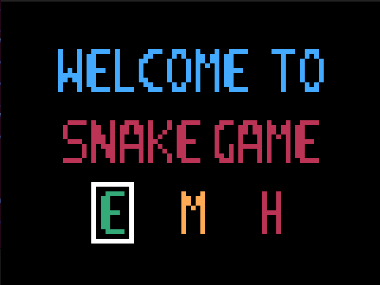
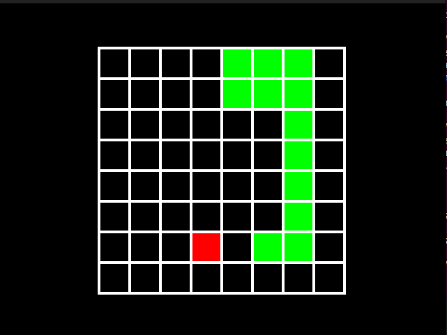
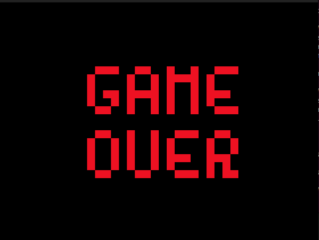

# HDL-Snake-Game

 This Repository contains the Verilog Implementation of the Retro Snake Game. It has been designed to run on a Xilinx Nexys A7 100T Field Programmable Gate Array. 

 ## Project Overview 

 Designing the Snake Game with multiple game difficulty modes and a main menu and a game over screen. The apple would spawn in pseudo randomly generated legal location, for the user to control the snake to eat.

 This project was first verified using a Verilog VGA simulation library created by user : SamanMohseni

 At Repo : https://github.com/SamanMohseni/VGA-Simulation

 With a few changes to his code I could simulate the working of the game without the need to test it on the FPGA.

 To display the Home and the Game over Screen, I created the images and passed it to a Python script that converted the .BMP file to a Verilog ROM file. 

 ## Key Features 
The Apple is spawned using a pseudo random number generator that prevents the apple from spawning on the snake or out of the board area. 

There are also different board sizes, which can be chosen form accoring to the game difficulty. 

## Game Screens : 

### Home Screen

  

In this screen the difficulty can be chosen by the user. To select a given difficulty press the Up arrow.

### Game Screen 

  

The game board is larger in higher difficulties. 

### Game Over

  

## Conclusion 

I created this Project after implemeting The Pong Game that can be found at : https://github.com/CarltonLobo/VerilogPong.git which could be played in single or multi player modes. I intend to merge the two games to make a simple retro game console. 